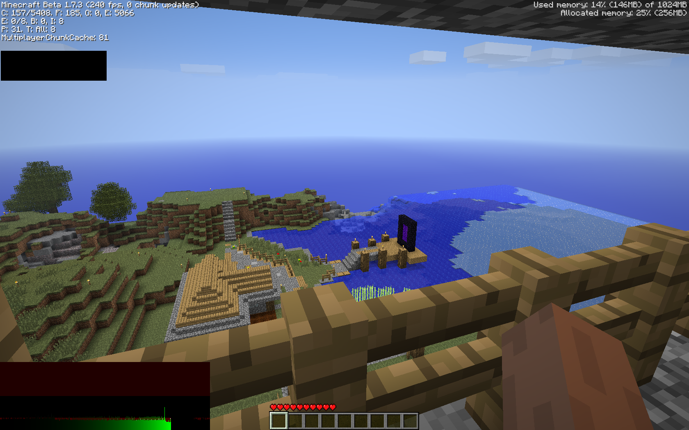
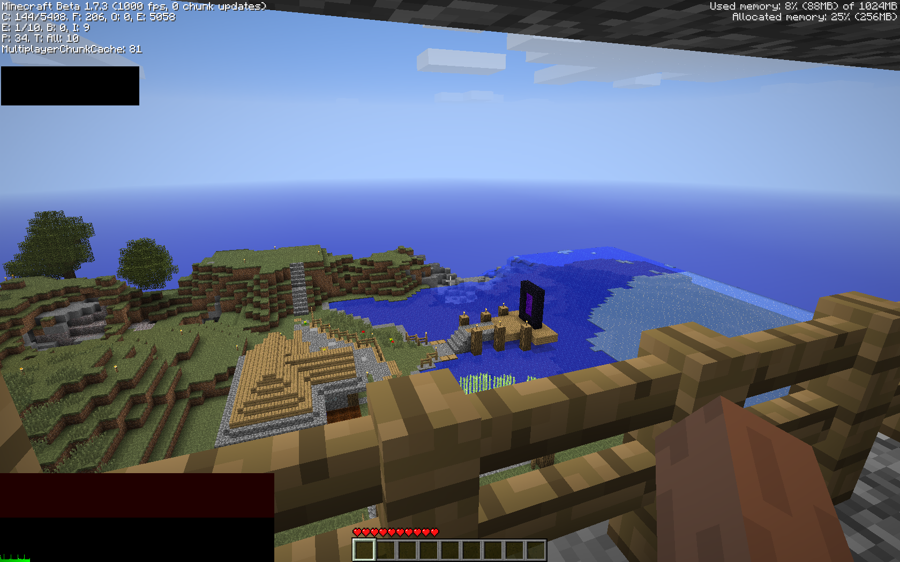

# amphetamine -- beta minecraft on illicit substances

amphetamine is a Babric mod designed for optimizing Minecraft rendering on M-series Macs. amphetamine is a fork of SmoothBeta.  
changes include:
* overhauled terrain rendering
* faster frustum culling math
* frustum culling on block entities
* batched text rendering
* faster sign rendering
* faster terrain tessellation

unlike smoothbeta, amphetamine only uses OpenGL functions <=2.1 to optimize rendering.

fps comparison: vanilla vs. amphetamine

### vanilla

### amphetamine

###### (test was done on a remote server, exact same settings. both samples were given 15 seconds of load time before recording result)

 

**warning: amphetamine heavily rewrites minecraft rendering. amphetamine may not be compatible with mods that also modify rendering. your mileage may vary.**

---
amphetamine is released under the CC0 license.